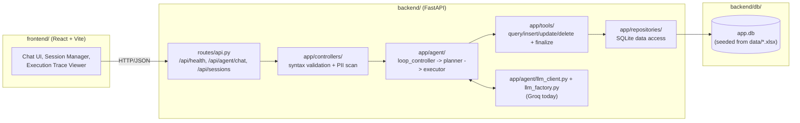

# System Design — AI Excel Assistant

This is the map of the repository: what each top-level part does, how they
talk to each other, and where to go for more detail. Read this first; then
drill into [`docs/agent-architecture.md`](docs/agent-architecture.md) (the
agent runtime spec) or [`DECISIONS.md`](DECISIONS.md) (why things were built
the way they were).

---

## 1. Repository shape

The repo is split into three independently-runnable parts, each with its own
`README.md`:

| Part | What it is | Owns |
|---|---|---|
| [`backend/`](backend/README.md) | FastAPI app + from-scratch ReAct agent loop | HTTP API, agent loop, tools, SQLite data layer, tests |
| [`frontend/`](frontend/README.md) | React (Vite) chat UI | Chat window, session manager, execution-trace/diagnostics views |
| [`docs/`](docs) | Product & architecture documentation | PRD, agent runtime spec, historical implementation tickets |

`backend/` and `frontend/` communicate over plain HTTP/JSON — there is no
shared code, shared types, or monorepo build tooling between them. Either
side can be redeployed independently as long as the other still speaks the
same REST contract (`docs/agent-architecture.md` §0 and §2.7).

```
project_root/
├── backend/     # Python 3.10+, FastAPI, SQLite — see backend/README.md
├── frontend/    # React 18 + Vite + Tailwind — see frontend/README.md
├── docs/        # PRD, agent-architecture.md, issues/ (historical tickets)
├── README.md    # Project overview & quick start
├── DESIGN.md    # This file
└── DECISIONS.md # Architecture decisions & trade-offs log
```

---

## 2. Architecture overview



The full step-by-step request lifecycle (route → controller → security scan →
loop controller → planner → executor → tool → repository → response) is
specified in detail in [`docs/agent-architecture.md`](docs/agent-architecture.md#0-request-flow--api-route--controller--agent).

---

## 3. Tech stack

| Layer | Choice | Why |
|---|---|---|
| Backend framework | FastAPI + Uvicorn | Async-capable, built-in OpenAPI docs, dependency injection for rate limiting/middleware |
| Data store | SQLite | Local, zero-ops, sufficient for a single-writer hiring-task scope (see `DECISIONS.md` #1, #4) |
| Agent loop | Plain Python (no framework) | Task requirement — every planner/executor/tool/retry primitive is hand-rolled |
| LLM provider | Groq (`llama-3.3-70b-versatile`) | Free tier, OpenAI-compatible tool-calling, fast (see `DECISIONS.md` #5, #7) |
| Frontend framework | React 18 + Vite | Fast dev server, no SSR needed for a single-page dashboard |
| Styling | Tailwind CSS | Utility-first, matches the design system used across `frontend/src/components/` |
| Testing | pytest | Backend unit tests over agent/tools/repositories/controllers (152 tests as of this writing) |

---

## 4. Data flow summary

1. **Seed**: `backend/db/seed_database.py` reads `backend/data/*.xlsx` and
   loads `real_estate_listings` / `marketing_campaigns` into
   `backend/db/app.db` via migrations in `backend/db/migrations/`.
2. **Chat request**: Frontend calls `POST /api/agent/chat` with an optional
   `session_id` and a `message`.
3. **Validation**: `AgentController` checks basic syntax, then
   `app/utilities/security.py` scans for PII/secrets — rejected requests
   never reach the LLM.
4. **Agent loop**: `loop_controller.run()` loads session context, then
   repeatedly calls the planner (one LLM call per step) and dispatches the
   chosen tool via the executor, until `finalize` is called or `MAX_STEPS`
   is hit.
5. **Tools → repositories → SQLite**: every data tool validates input, then
   delegates the actual query to a repository method; tools never touch SQL
   directly.
6. **Response**: the final answer and (possibly new) `session_id` are
   returned to the frontend, which renders it in the chat window and — if
   using the diagnostics view — the full execution trace.

---

## 5. Where to go next

- **Building/debugging the agent itself?** → [`docs/agent-architecture.md`](docs/agent-architecture.md)
- **Wondering why a specific trade-off was made?** → [`DECISIONS.md`](DECISIONS.md)
- **Setting up the backend locally?** → [`backend/README.md`](backend/README.md)
- **Setting up the frontend locally?** → [`frontend/README.md`](frontend/README.md)
- **Product requirements / example queries?** → [`docs/PRD.md`](docs/PRD.md)
- **Curious how a specific feature was originally scoped?** → [`docs/issues/`](docs/issues) (historical per-feature implementation tickets; paths inside predate the `backend/` restructuring, treat `agent-architecture.md` as authoritative for current file locations)
