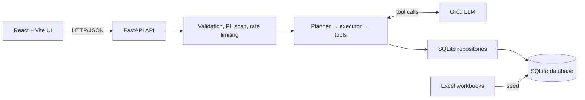

# AI Excel Assistant

A full-stack conversational assistant for exploring and managing two Excel
datasets: real-estate listings and marketing campaigns. Ask a question in
plain language and the agent selects validated, purpose-built tools to query,
add, update, or delete the corresponding SQLite records.

The agent runtime is implemented in plain Python. It does not use LangChain,
LlamaIndex, AutoGen, CrewAI, or another agent framework.

## Demo

🌐 **Live Demo:** [https://ai-task.tha-bet.software/](https://ai-task.tha-bet.software/)


## What it does

- Queries real-estate listings and marketing campaigns with natural language
- Creates, updates, and deletes records through typed tool inputs
- Persists conversation context in SQLite sessions
- Seeds the local database from the supplied Excel workbooks
- Displays the conversation, sessions, and agent execution details in a React UI
- Applies request validation, PII/secret detection, rate limiting, structured
  logging, tool retries, and a bounded agent loop

## Architecture at a glance



The backend migrates and seeds data into SQLite. The Excel files are source
data, not the files modified during chat. The seeder updates source rows by
their IDs; deleting the database before seeding performs a full reset.

For the detailed request lifecycle and tool design, see
[Agent Architecture](docs/agent-architecture.md).

## Tech stack

- Backend: Python 3.10+, FastAPI, Pydantic, SQLite, pandas, and pytest
- Agent: from-scratch ReAct-style planner/executor loop with Groq function calling
- Frontend: React 18, Vite, Tailwind CSS, and Lucide
- Data: `Real Estate Listings.xlsx` and `Marketing Campaigns.xlsx`

## Quick start

### Prerequisites

- Python 3.10 or later
- Node.js 18 or later
- Git

### 1. Clone and prepare the backend

```bash
git clone <your-github-repository-url>
cd Junior-AI-Engineer-Task

python -m venv venv
```

Activate the virtual environment:

```powershell
# Windows PowerShell
.\venv\Scripts\Activate.ps1
```

```bash
# macOS / Linux
source venv/bin/activate
```

Install backend dependencies:

```bash
cd backend
pip install -r requirements.txt
```

### 2. Configure the application

Create a local environment file from the example:

```powershell
# Windows PowerShell, from backend/
Copy-Item .env.example .env
```

```bash
# macOS / Linux, from backend/
cp .env.example .env
```

Add a Groq API key to `backend/.env` to use the chat agent:

```env
LLM_PROVIDER=groq
GROQ_API_KEY=your_groq_api_key
```

`MAX_LOOP_ITERATIONS`, `TOOL_TIMEOUT_SECONDS`, the model name, and logging level are also
configured in this file. See [`backend/.env.example`](backend/.env.example) for
the complete list.

### 3. Seed the database and start the API

From `backend/`:

```bash
python -m db.seed_database
uvicorn main:app --reload --port 8000
```

The API is now available at:

- API documentation: http://localhost:8000/docs
- Health check: http://localhost:8000/api/health
- Chat endpoint: `POST http://localhost:8000/api/agent/chat`

### 4. Start the frontend

Open a second terminal at the repository root:

```bash
cd frontend
npm install
npm run dev
```

Open http://localhost:3000. The Vite development server proxies `/api` requests
to `http://127.0.0.1:8000` by default.

## Using the assistant

The chat UI is the simplest way to use the project. You can also call the API
directly:

```bash
curl -X POST http://localhost:8000/api/agent/chat \
  -H "Content-Type: application/json" \
  -d "{\"message\":\"Show all houses in Illinois under $400,000\"}"
```

The response includes an answer and a `session_id`. Pass that ID in later
requests to continue the same conversation:

```json
{
  "session_id": "existing-session-id",
  "message": "Now show only the available listings."
}
```

### Example prompts

**Real estate**

- `Show all houses in Illinois under $400,000`
- `Add a new property: 4 bed, 3.5 bath house in Austin, Texas listed for $650,000`
- `Update listing LST-5001 status to Sold and set sale price to $360,000`
- `Delete listing LST-5002`

**Marketing campaigns**

- `Which campaign generated the highest revenue?`
- `Create a new campaign named "Fall Sale" on Facebook with budget $15,000`
- `Change the budget allocated for CMP-8001 to $30,000`
- `Calculate the total amount spent across all channels`

## API surface

- `GET /api/health` — verify that the API is running
- `POST /api/agent/chat` — send a message, optionally with a `session_id`
- `POST /api/sessions/` — create a named session
- `GET /api/sessions/` — list sessions
- `GET /api/sessions/{session_id}` — retrieve a session and its context
- `DELETE /api/sessions/{session_id}` — delete a session

Use the OpenAPI UI at `/docs` for request and response schemas.

## Project layout

```text
.
├── backend/       # FastAPI app, agent runtime, tools, SQLite layer, tests
├── frontend/      # React/Vite chat application
├── docs/          # Product, architecture, and historical implementation docs
├── DESIGN.md      # System map and repository-level architecture
├── DECISIONS.md   # Architecture decisions and trade-offs
└── README.md      # Project overview and full-stack quick start
```

Component-specific setup and development information lives in
[`backend/README.md`](backend/README.md) and
[`frontend/README.md`](frontend/README.md).

## Running tests

From `backend/`:

```bash
pytest
```

The test suite uses an in-memory SQLite database and does not modify
`backend/db/app.db`.

## Documentation

- [System Design](DESIGN.md) — repository map and component boundaries
- [Agent Architecture](docs/agent-architecture.md) — request lifecycle,
  planner, executor, tools, sessions, logging, and safeguards
- [Product Requirements Document](docs/PRD.md) — product scope and user flows
- [Architecture Decisions](DECISIONS.md) — key technical trade-offs
- [Backend README](backend/README.md) — backend-specific setup and structure
- [Frontend README](frontend/README.md) — frontend setup and UI details

## Troubleshooting

**The chat endpoint cannot reach the LLM**<br>
Confirm that `GROQ_API_KEY` is present in `backend/.env`, then restart Uvicorn.

**The frontend cannot call the API**<br>
Start the backend on port `8000`. When using the Vite server, requests to
`/api` are proxied to `http://127.0.0.1:8000`.

**You want a clean dataset**<br>
Stop the API, delete `backend/db/app.db`, then run `python -m db.seed_database`
from `backend/`. The seeder alone refreshes rows in the source workbooks but
does not remove records created during chat.
