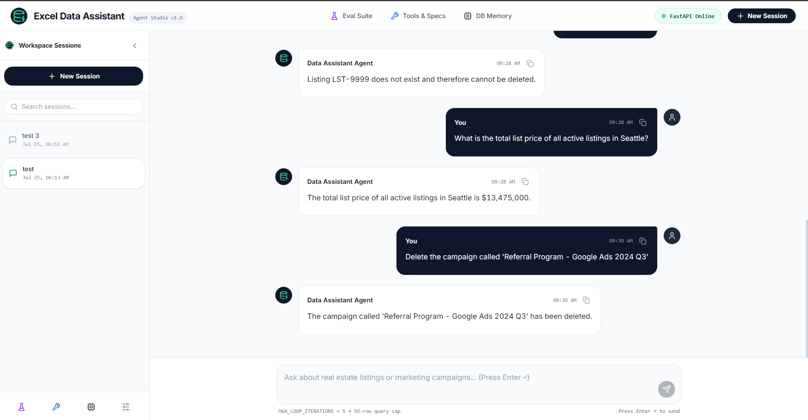
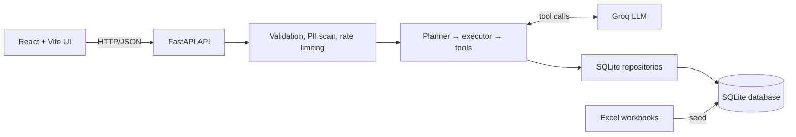

# AI Excel Assistant

> A full-stack, autonomous conversational data assistant for exploring and managing Excel datasets (**Real Estate Listings** & **Marketing Campaigns**) using a custom ReAct-style agent runtime built from scratch.

[](https://ai-task.tha-bet.software/)
[](https://www.python.org/)
[](https://fastapi.tiangolo.com/)
[](https://react.dev/)
[](https://groq.com/)

---

## 🌐 Demo

**Live App:** [https://ai-task.tha-bet.software/](https://ai-task.tha-bet.software/)



---

## 💡 What it does

- **Natural Language Data Management**: Query, insert, update, and delete real estate listings and marketing campaign records using plain English commands.
- **Zero Framework Bloat**: The agent loop, planner, executor, and tool dispatchers are written strictly from scratch in standard Python (no LangChain, AutoGen, or CrewAI).
- **Session & Context Persistence**: Full conversational memory persisted across multi-turn sessions with automatic windowing and payload compaction in SQLite.
- **Enterprise Safeguards**: Built-in PII/secret regex scanning, pre-flight input guardrails (8B classifier), rate limiting, structured JSON logging, and deterministic loop iteration caps.
- **Seeded Excel Integration**: Automatically ingests source data from `Real Estate Listings.xlsx` and `Marketing Campaigns.xlsx` into relational SQLite tables.

---

## 📐 Architecture at a glance



> [!IMPORTANT]
> **Deep Dive Specification**: For complete details on the request lifecycle, memory windowing, tool registries, and safeguards, refer to the **[Agent Architecture Specification](docs/agent-architecture.md)**.

---

## 🛠️ Tech stack

- **Backend**: Python 3.10+, FastAPI, Pydantic v2, SQLite, pandas, pytest
- **Agent Runtime**: Custom ReAct-style loop with Groq tool calling (`llama-3.3-70b-versatile` planner + `llama-3.1-8b-instant` guardrail)
- **Frontend**: React 18, Vite, Tailwind CSS, Lucide Icons
- **Data Layer**: SQLite initialized from `Real Estate Listings.xlsx` and `Marketing Campaigns.xlsx`

---

## ⚡ Quick start

### Prerequisites

- Python 3.10+
- Node.js 18+
- Git

### 1. Clone & Setup Backend

```bash
git clone <your-github-repository-url>
cd Junior-AI-Engineer-Task

python -m venv venv
```

Activate the virtual environment:

```powershell
# Windows PowerShell
.\venv\Scripts\Activate.ps1
```

```bash
# macOS / Linux
source venv/bin/activate
```

Install backend dependencies:

```bash
cd backend
pip install -r requirements.txt
```

### 2. Configure Environment

Create a local environment file:

```powershell
# Windows PowerShell, from backend/
Copy-Item .env.example .env
```

```bash
# macOS / Linux, from backend/
cp .env.example .env
```

Set your Groq API key in `backend/.env`:

```env
LLM_PROVIDER=groq
GROQ_API_KEY=your_groq_api_key
```

### 3. Seed Database & Start API

From `backend/`:

```bash
python -m db.seed_database
uvicorn main:app --reload --port 8000
```

The API will be live at:
- **Interactive OpenAPI Specs**: http://localhost:8000/docs
- **Health Endpoint**: http://localhost:8000/api/health

### 4. Start Frontend Studio

In a second terminal from the project root:

```bash
cd frontend
npm install
npm run dev
```

Navigate to **http://localhost:3000** in your browser.

---

## 💬 Example Prompts

### Real Estate
- `Show all houses in Illinois under $400,000`
- `Add a new property: 4 bed, 3.5 bath house in Austin, Texas listed for $650,000`
- `Update listing LST-5001 status to Sold and set sale price to $360,000`
- `Delete listing LST-5002`

### Marketing Campaigns
- `Which campaign generated the highest revenue?`
- `Create a new campaign named "Fall Sale" on Facebook with budget $15,000`
- `Change the budget allocated for CMP-8001 to $30,000`
- `Calculate the total amount spent across all channels`

---

## 📁 Project layout

```text
.
├── backend/       # FastAPI app, agent runtime, tool registry, SQLite layer, tests
├── frontend/      # React / Vite chat interface & benchmark suite
├── docs/          # Agent architecture specification & deployment guide
├── DECISIONS.md   # Architectural Decisions Record (ADR)
└── README.md      # Project overview and full-stack quick start
```

---

## 🧪 Running tests

Execute unit tests from `backend/`:

```bash
pytest
```

The test suite runs against an in-memory SQLite database and does not alter `backend/db/app.db`.

---

## 📚 Documentation

> [!NOTE]
> ### 📖 Core Architecture Document
> ⭐ **[Agent Architecture Specification](docs/agent-architecture.md)**
> *The authoritative specification covering request lifecycle, planner, executor, tool schemas, session memory, guardrails, and logging contracts.*

- **[Architecture Decisions](DECISIONS.md)** — Architectural decision log and technical trade-offs
- **[Backend Guide](backend/README.md)** — Backend setup, directory structure, and runtime details
- **[Frontend Guide](frontend/README.md)** — Frontend setup, UI components, and state management
