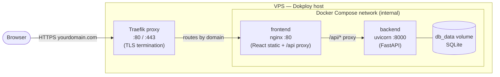
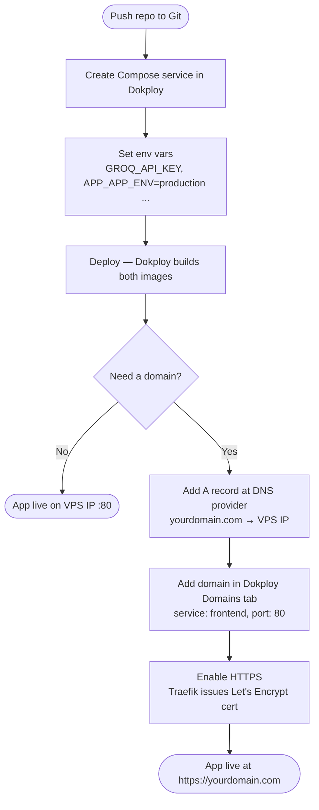

# Deployment Guide — Dokploy

This guide deploys the full stack (FastAPI backend + React/Vite frontend) to a
small VPS using the [Dokploy](https://dokploy.com) server panel and Docker
Compose.

## How traffic flows

Dokploy ships with **Traefik** as its built-in reverse proxy. Traefik sits in
front of every service on the VPS and handles:

- Routing incoming HTTP/HTTPS traffic to the right container by domain name.
- Automatic TLS certificate provisioning via Let's Encrypt.
- HTTP → HTTPS redirect.

You do **not** expose the backend container to the internet at all. The request
path is:



nginx handles the `/api/` → `backend:8000` proxy on the internal Compose
network; Traefik never talks to the backend directly.

## What gets deployed

| Service | Image | Role |
|---|---|---|
| `backend` | `python:3.12-slim` | FastAPI API served by uvicorn on port `8000` (internal Compose network only). SQLite DB persisted in the `db_data` volume. |
| `frontend` | `nginx:alpine` | Serves the built React app and reverse-proxies `/api/` to `backend:8000`. Traefik routes public traffic here. |

Relevant files at the repo root:

- `docker-compose.yml` — wires the two services together
- `backend/Dockerfile` — builds and runs the API
- `frontend/Dockerfile` — multi-stage build (pnpm build → nginx static serve)
- `frontend/nginx.conf` — SPA routing + `/api/` proxy to the backend

## Prerequisites

- A VPS (1 GB RAM is enough) with Dokploy installed. See the
  [Dokploy install docs](https://docs.dokploy.com/docs/core/installation).
- This repository pushed to GitHub/GitLab (public or with Dokploy granted access).
- A [Groq API key](https://console.groq.com/keys) for the LLM provider.

## Deployment flow



## Steps

### 1. Push the repo

Make sure `docker-compose.yml` and both Dockerfiles are committed and pushed to
your Git provider.

### 2. Create the project in Dokploy

1. Open the Dokploy dashboard.
2. **Create Project** → give it a name (e.g. `ai-excel-assistant`).
3. Inside the project, **Create Service** → **Compose**.
4. Connect your Git provider and select this repository + branch.
5. Set **Compose Path** to `docker-compose.yml` (repo root).

### 3. Configure environment variables

The backend reads its config from `backend/.env` (see `backend/.env.example`
for the full list). In Dokploy, add the environment variables under the
service's **Environment** tab. At minimum:

```env
APP_APP_ENV=production
GROQ_API_KEY=your_real_groq_key_here
LLM_PROVIDER=groq
LLM_MODEL=llama-3.3-70b-versatile
GUARDRAIL_ENABLED=true
GUARDRAIL_MODEL=llama-3.1-8b-instant
```

Setting `APP_APP_ENV=production` disables `/docs`, `/redoc`, and `/openapi.json`.

> The Compose file uses `env_file: ./backend/.env`. If you manage secrets
> through Dokploy's Environment tab instead of a committed `.env`, Dokploy
> writes them into the build context — keep real keys out of Git either way.

### 4. Deploy

Click **Deploy**. Dokploy builds both images and starts the stack. The frontend
publishes port `80`; the backend stays on the internal Compose network and is
reached only through the nginx `/api/` proxy.

### 5. Point your domain's DNS to the VPS

Before adding the domain in Dokploy, create an **A record** at your DNS
provider:

| Type | Name | Value |
|---|---|---|
| A | `@` (or `yourdomain.com`) | your VPS public IP |
| A | `www` | your VPS public IP |

DNS propagation can take a few minutes to a few hours.

### 6. Add the domain in Dokploy and enable HTTPS

Dokploy uses **Traefik** as its built-in reverse proxy. Traefik runs on the VPS
alongside your containers and is the only process that listens on ports `80` and
`443`. It routes incoming requests to the right container by domain name and
handles TLS automatically — you do not need to configure certificates yourself.

To attach your domain:

1. Open the Compose service in Dokploy → **Domains** tab → **Add Domain**.
2. Enter your domain (e.g. `yourdomain.com`).
3. Set **Service** to `frontend` and **Container Port** to `80`.
4. Toggle **HTTPS** on — Traefik will request a Let's Encrypt certificate the
   first time a request arrives for that domain.
5. Save and **Redeploy** so Traefik picks up the new routing rule.

After the redeploy, `https://yourdomain.com` serves the React app and
`https://yourdomain.com/api/` is proxied through nginx to the backend. No
changes to `nginx.conf` or `docker-compose.yml` are needed — Traefik sits in
front of the frontend container and terminates TLS before the request ever
reaches nginx.

> If the certificate fails to issue, confirm the A record has propagated
> (`dig yourdomain.com`) and that port `80` is open in your VPS firewall
> (Traefik needs it for the ACME HTTP-01 challenge).

## Data persistence

The SQLite database lives in the `db_data` named volume, mounted at `/app/db`
in the backend container. It survives redeploys. To reset the database, delete
the volume from Dokploy's **Volumes** view and redeploy — migrations in
`backend/db/migrations/` re-run automatically on startup via `init_db()`.

## Updating

Push to the tracked branch and click **Redeploy** (or enable auto-deploy via
webhook in Dokploy). Images rebuild and containers restart with zero manual
steps.

## Troubleshooting

- **Frontend loads but API calls 502/404** — confirm the backend container is
  healthy in Dokploy logs and that `nginx.conf` proxies to `backend:8000`
  (the Compose service name).
- **Backend crashes on startup** — usually a missing `GROQ_API_KEY` or malformed
  env var. Check the backend logs in Dokploy.
- **Build fails on `pnpm install`** — ensure `frontend/pnpm-lock.yaml` is
  committed; the Dockerfile uses `--frozen-lockfile`.
