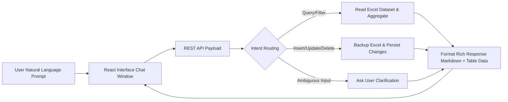

# Product Requirements Document (PRD)
## AI Excel Assistant — Junior AI Engineer Task

---

## 1. Overview

### 1.1 Product Summary
An AI-powered conversational assistant that allows users to interact with two Excel datasets — a real estate listings file and a marketing campaigns file — using plain natural language. The assistant understands intent, routes requests to the appropriate custom-built tool, and executes CRUD operations (Create, Read, Update, Delete) directly on the Excel files.

### 1.2 Problem Statement
Non-technical users and analysts frequently need to query or manipulate structured data stored in Excel files. Doing this manually requires knowledge of Excel formulas or Python/SQL. This assistant eliminates that friction by accepting natural language as the only input.

### 1.3 Goals
- Maximize **ease of use**: any reasonable natural language request must be handled gracefully.
- Maintain **data integrity**: all write operations (insert, modify, delete) must persist to the Excel files without corrupting structure.
- Achieve **broad coverage**: support a wide range of query types — filtering, aggregation, sorting, comparison, and full CRUD.
- Remain **framework-free**: build the tool layer from scratch with no LangChain, LlamaIndex, AutoGen, CrewAI, or similar.
### 1.4 Product User Workflow

## 2. Stakeholders

| Role | Concern |
|---|---|
| Hiring Team / Evaluators | Correctness, design thinking, live defensibility |
| End User (simulated) | Ease of use, accuracy of responses |
| Developer | Clean code, extensible tool layer, good tradeoffs documented |

---

## 3. Data Sources

### 3.1 `Real Estate Listings.xlsx`
U.S. property listings dataset (`LST-xxxx` format). Exact columns:
- `Listing ID` (e.g., `LST-5001`)
- `Property Type` (e.g., `House`, `Condo`)
- `City` (e.g., `Aurora`, `Bellevue`)
- `State` (e.g., `Illinois`, `Washington`)
- `Bedrooms` (e.g., `3`, `4`)
- `Bathrooms` (e.g., `1.5`, `3.5`)
- `Square Footage` (e.g., `1,091`)
- `Year Built` (e.g., `1971`, `1960`)
- `List Price` (e.g., `$351,000`)
- `Sale Price` (e.g., `$360,000`)
- `Listing Status` (e.g., `Sold`, `Active`, `Pending`)

### 3.2 `Marketing Campaigns.xlsx`
Campaign performance dataset (`CMP-xxxx` format). Exact columns:
- `Campaign ID` (e.g., `CMP-8001`)
- `Campaign Name` (e.g., `Back to School - Facebook 2025 Q3`)
- `Channel` (e.g., `Facebook`, `LinkedIn`, `Instagram`)
- `Start Date` (e.g., `04/11/2025`)
- `End Date` (e.g., `05/08/2025`)
- `Budget Allocated` (e.g., `$25,000`)
- `Amount Spent` (e.g., `$23,697.26`)
- `Impressions` (e.g., `5,058,725`)
- `Clicks` (e.g., `248,564`)
- `Conversions` (e.g., `13,472`)
- `Revenue Generated` (e.g., `$67,314.37`)

---

## 4. Functional Requirements

### 4.1 Core Capabilities

| ID | Requirement | Priority |
|---|---|---|
| FR-01 | Accept natural language queries from the user via a modern React Web Interface & REST API | Must Have |
| FR-02 | Understand which dataset the user is referring to (real estate or marketing) | Must Have |
| FR-03 | Read / Query data — filter, sort, aggregate, search by any field | Must Have |
| FR-04 | Insert new records into either dataset | Must Have |
| FR-05 | Modify / Update existing records by ID or matching criteria | Must Have |
| FR-06 | Delete records by ID or matching criteria | Must Have |
| FR-07 | Return clear, human-readable responses along with structured JSON for UI display | Must Have |
| FR-08 | Persist all changes back to the Excel file | Must Have |
| FR-09 | Handle ambiguous requests gracefully (ask for clarification) | Should Have |
| FR-10 | Multi-turn conversation memory within a session | Should Have |
| FR-11 | Support aggregations: count, sum, average, min, max, group by | Should Have |
| FR-12 | Display interactive data preview tables & operational status in React UI | Should Have |

---

## 5. Non-Functional Requirements

| ID | Requirement | Target |
|---|---|---|
| NFR-01 | Response latency | < 5 seconds per turn (free LLM dependent) |
| NFR-02 | Accuracy | ≥ 90% correct intent classification on reasonable requests |
| NFR-03 | Data safety | No data loss on write; backup before destructive ops |
| NFR-04 | Portability | Runs on Python 3.10+ with pip-installable dependencies |
| NFR-05 | No paid APIs | All LLM calls use free tier or local models |
| NFR-06 | Code quality | Clean, readable, documented; defensible in a 30-min live call |

---

## 6. Out of Scope

- Web UI or API server (CLI only)
- Authentication / multi-user access
- Real-time Excel collaboration
- Support for file formats other than `.xlsx`
- Paid LLM APIs

---

## 7. Deliverables

| Item | Description |
|---|---|
| `main.py` (or equivalent entry point) | Runnable CLI assistant |
| Custom tool implementations | `tools/` directory with all tool functions |
| LLM integration layer | `llm/` or `agent/` — prompt construction & response parsing |
| `README.md` | Setup, usage instructions, example queries |
| `DECISIONS.md` | Architecture decisions, tradeoffs, what you'd do differently |
| `requirements.txt` | All Python dependencies pinned |
| Public GitHub repository | Everything committed, clean history |

---

## 8. Success Criteria

- [ ] Can correctly answer 10+ distinct natural language queries on each file
- [ ] All CRUD operations persist to disk correctly
- [ ] LLM correctly routes to the right tool in ≥ 90% of test cases
- [ ] Clear, informative user responses (not raw JSON dumps)
- [ ] Developer can explain every design choice under pressure in a 30-min call
