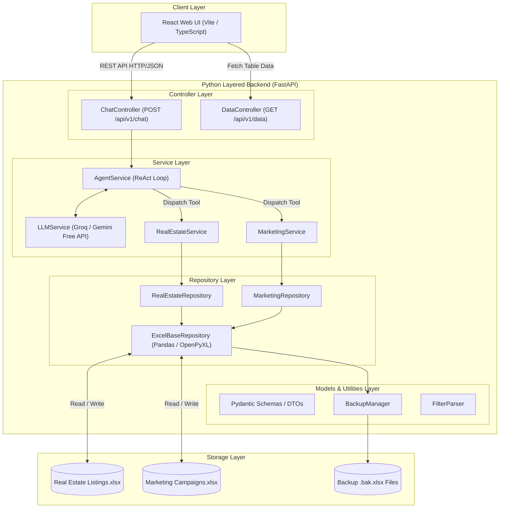
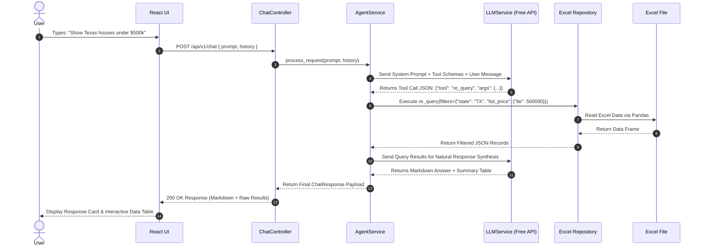
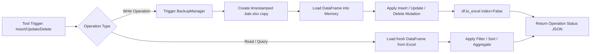

# Technical Specifications
## AI Excel Assistant — Junior AI Engineer Task

---

## 1. Architecture Overview

The application is structured into a **React Frontend** and a **Layered Python Backend REST API** powering a **ReAct-style agent loop** (Reason + Act) built strictly from scratch — no frameworks (LangChain, LlamaIndex, AutoGen, CrewAI, etc.).

### 1.1 High-Level Layered Architecture



### 1.2 ReAct Agent Execution Sequence



---

## 2. System Components & Directory Layout

### 2.1 Complete Directory Structure

```
project/
├── frontend/                     # React Frontend Application
│   ├── public/                   # Static assets
│   ├── src/
│   │   ├── components/           # UI Components (ChatWindow, MessageItem, DataGrid, Header)
│   │   ├── services/             # API client services (chatApi.ts, dataApi.ts)
│   │   ├── types/                # TypeScript interface definitions
│   │   ├── App.tsx               # Main UI Application wrapper
│   │   └── main.tsx              # React DOM entry point
│   ├── package.json              # Frontend dependencies
│   └── vite.config.ts            # Vite configuration
│
├── backend/                      # Layered Python Backend Application
│   ├── app/
│   │   ├── controllers/          # HTTP Endpoint Route Handlers
│   │   │   ├── chat_controller.py      # POST /api/v1/chat
│   │   │   ├── data_controller.py      # GET /api/v1/data/real-estate & marketing
│   │   │   └── health_controller.py    # GET /api/v1/health
│   │   │
│   │   ├── services/             # Business Logic & Agent Execution
│   │   │   ├── agent_service.py       # Core ReAct agent loop
│   │   │   ├── llm_service.py         # Free LLM provider adapter (Groq, Gemini)
│   │   │   ├── real_estate_service.py # Real estate CRUD business logic
│   │   │   └── marketing_service.py   # Marketing campaign CRUD business logic
│   │   │
│   │   ├── repositories/         # Data Access Layer (Excel Storage)
│   │   │   ├── excel_base_repository.py   # Generic Excel pandas read/write base
│   │   │   ├── real_estate_repository.py # Real estate Excel operations
│   │   │   └── marketing_repository.py   # Marketing campaigns Excel operations
│   │   │
│   │   ├── models/               # Data Schemas & Pydantic Models
│   │   │   ├── chat_model.py          # Request/Response payloads
│   │   │   ├── real_estate_model.py   # Property record schema
│   │   │   └── marketing_model.py     # Campaign record schema
│   │   │
│   │   ├── utilities/            # Helper Utilities
│   │   │   ├── backup_manager.py      # Timestamped Excel backup maker
│   │   │   ├── filter_parser.py       # Standardized condition filter evaluator
│   │   │   ├── response_formatter.py  # Response markdown & table builder
│   │   │   └── logger.py              # Centralized logging setup
│   │   │
│   │   └── main.py               # FastAPI application entry point & CORS configuration
│   │
│   └── tests/                    # Backend Automated Test Suite
│       ├── unit/                 # Unit tests for repositories & services
│       │   ├── test_filter_parser.py
│       │   ├── test_real_estate_repository.py
│       │   └── test_marketing_repository.py
│       └── integration/          # End-to-end integration tests
│           ├── test_agent_loop.py
│           └── test_chat_endpoints.py
│
├── data/                         # Excel Data Source Directory
│   ├── Real Estate Listings.xlsx
│   └── Marketing Campaigns.xlsx
│
├── .env.example                  # Environment configuration template
├── requirements.txt              # Backend Python dependencies
├── README.md                     # Project documentation & setup instructions
└── DECISIONS.md                  # Design choices, trade-offs, and rationale
```

---

## 3. Agent Loop Specification

### 3.1 Prompt Structure

```
SYSTEM:
  You are an AI assistant that manages two Excel datasets.
  You MUST respond with a JSON object selecting a tool to call.
  Never respond with plain text on the first turn — always call a tool.

  Available tools: [<tool definitions>]

  Rules:
  - Choose exactly one tool per turn.
  - Output ONLY valid JSON: {"tool": "<name>", "args": {…}}
  - If the user request is ambiguous, use the "ask_clarification" tool.

HISTORY:
  [{"role": "user", "content": "…"}, {"role": "assistant", "content": "…"}, …]

USER:
  <current message>
```

### 3.2 Agent Loop Pseudocode

```python
def run_agent(user_input: str, history: list) -> str:
    # Step 1: Ask LLM to select tool
    tool_prompt = prompt_builder.build(user_input, history)
    tool_response = llm.call(tool_prompt)
    parsed = parse_json(tool_response)  # {"tool": "...", "args": {...}}

    # Step 2: Execute tool
    tool_fn = registry.get(parsed["tool"])
    tool_result = tool_fn(**parsed["args"])

    # Step 3: Ask LLM to synthesize final answer
    answer_prompt = prompt_builder.build_answer(user_input, tool_result, history)
    final_answer = llm.call(answer_prompt)

    # Step 4: Update history
    history.append({"role": "user", "content": user_input})
    history.append({"role": "assistant", "content": final_answer})

    return final_answer
```

### 3.3 JSON Parsing Fallback
- Use `json.loads()` first.
- If that fails, use regex to extract the first `{...}` JSON block from LLM output.
- If still failing, return a graceful error message + log the raw output.

---

## 4. Tool Specifications

All tools are plain Python functions registered in `registry.py`.

### 4.1 Tool Registry

```python
TOOLS: dict[str, Callable] = {
    "re_query": real_estate.query.run,
    "re_insert": real_estate.insert.run,
    "re_update": real_estate.update.run,
    "re_delete": real_estate.delete.run,
    "mc_query": marketing.query.run,
    "mc_insert": marketing.insert.run,
    "mc_update": marketing.update.run,
    "mc_delete": marketing.delete.run,
    "ask_clarification": clarification.run,
}
```

---

### 4.2 Real Estate Tools

#### `re_query` — Read / Filter / Aggregate

```
Tool Name:    re_query
Description:  Read or query real estate listings. Supports filtering, sorting, and aggregation.
Args:
  filters      (dict, optional) — e.g., {"state": "TX", "bedrooms": {"gte": 3}, "price": {"lte": 500000}}
  sort_by      (str, optional)  — column name to sort by
  sort_order   (str, optional)  — "asc" | "desc"
  aggregate    (dict, optional) — {"func": "mean|sum|count|min|max", "column": "listing_price", "group_by": "state"}
  limit        (int, optional)  — max rows to return
Returns:
  {"data": [...], "count": N, "summary": "..."}
```

**Filter Operators supported:**
| Operator | Meaning | Example |
|---|---|---|
| `eq` | equals | `{"state": "TX"}` or `{"state": {"eq": "TX"}}` |
| `neq` | not equals | `{"status": {"neq": "Sold"}}` |
| `gt`, `gte` | greater than (or equal) | `{"price": {"gte": 300000}}` |
| `lt`, `lte` | less than (or equal) | `{"days_on_market": {"lte": 60}}` |
| `contains` | substring match | `{"city": {"contains": "Austin"}}` |
| `in` | value in list | `{"state": {"in": ["TX", "CA", "NY"]}}` |

#### `re_insert` — Add New Property

```
Tool Name:    re_insert
Description:  Insert a new row into real_estate_listings.xlsx.
Args:
  record       (dict, required) — key/value pairs for all columns (missing cols → None)
Returns:
  {"success": true, "new_id": <assigned_id>, "message": "..."}
```

#### `re_update` — Modify Existing Property

```
Tool Name:    re_update
Description:  Update one or more fields on matching rows.
Args:
  filters      (dict, required) — identifies which rows to update
  updates      (dict, required) — fields to change and their new values
  confirm_multi (bool, optional) — if true, allow updating multiple rows
Returns:
  {"success": true, "rows_updated": N, "message": "..."}
```

#### `re_delete` — Remove Properties

```
Tool Name:    re_delete
Description:  Delete rows matching the given filters.
Args:
  filters      (dict, required) — identifies which rows to delete
  confirm_multi (bool, optional) — required true to delete > 1 row
Returns:
  {"success": true, "rows_deleted": N, "message": "..."}
```

---

### 4.3 Marketing Campaign Tools

#### `mc_query` — Read / Filter / Aggregate

```
Tool Name:    mc_query
Description:  Read or query marketing campaign performance data.
Args:
  filters      (dict, optional) — same operators as re_query
  sort_by      (str, optional)
  sort_order   (str, optional)  — "asc" | "desc"
  aggregate    (dict, optional) — {"func": "mean|sum|count|min|max|ratio", "column": "...", "group_by": "..."}
  limit        (int, optional)
Returns:
  {"data": [...], "count": N, "summary": "..."}
```

#### `mc_insert` — Add New Campaign

```
Tool Name:    mc_insert
Description:  Insert a new row into marketing_campaigns.xlsx.
Args:
  record       (dict, required)
Returns:
  {"success": true, "new_id": <assigned_id>, "message": "..."}
```

#### `mc_update` — Modify Campaign

```
Tool Name:    mc_update
Description:  Update fields on matching campaigns.
Args:
  filters      (dict, required)
  updates      (dict, required)
  confirm_multi (bool, optional)
Returns:
  {"success": true, "rows_updated": N, "message": "..."}
```

#### `mc_delete` — Remove Campaigns

```
Tool Name:    mc_delete
Description:  Delete campaigns matching filters.
Args:
  filters      (dict, required)
  confirm_multi (bool, optional)
Returns:
  {"success": true, "rows_deleted": N, "message": "..."}
```

---

### 4.4 Utility Tools

#### `ask_clarification`

```
Tool Name:    ask_clarification
Description:  Ask the user to clarify their request before proceeding.
Args:
  question     (str, required) — clarifying question to ask the user
Returns:
  {"clarification_requested": true, "question": "..."}
```

---

## 5. LLM Integration Layer

### 5.1 Supported Providers (Free Tier)

| Provider | Model | Notes |
|---|---|---|
| **Groq** | `llama-3.3-70b-versatile` | Fast, generous free tier (recommended) |
| **Google Gemini** | `gemini-2.0-flash` | 15 RPM free |
| **OpenRouter** | `mistral-7b-instruct` | Free with rate limits |
| **NVIDIA Build** | `meta/llama-3.1-70b-instruct` | Free tier available |

### 5.2 LLM Client Interface

```python
class LLMClient:
    def __init__(self, provider: str, model: str, api_key: str): ...
    def call(self, messages: list[dict]) -> str:
        """Send messages, return raw text response."""
        ...
```

### 5.3 Tool Definition Prompt Format
Each tool is described in the system prompt as a JSON schema block:

```json
{
  "name": "re_query",
  "description": "Read or filter real estate listings",
  "args": {
    "filters": {"type": "object", "description": "..."},
    "sort_by": {"type": "string", "description": "..."},
    "aggregate": {"type": "object", "description": "..."},
    "limit": {"type": "integer", "description": "..."}
  }
}
```

---

## 6. Data Layer

### 6.1 File I/O Strategy
- Use `pandas` for all read/write operations.
- Load the Excel file **once per tool call** (no in-memory cache) to avoid stale state.
- After each write operation, save back with `df.to_excel(path, index=False)`.
- **Before any destructive operation** (delete, update), create a timestamped `.bak` file:
  `real_estate_listings_2024-01-15T10-30-00.bak.xlsx`



### 6.2 ID Assignment
- **Real Estate Listings**: Primary key column is `Listing ID` (format: `LST-XXXX`, e.g., `LST-5001`). On insert, parse existing IDs, find `max(numeric_part) + 1`, and format as `LST-{next_num}`.
- **Marketing Campaigns**: Primary key column is `Campaign ID` (format: `CMP-XXXX`, e.g., `CMP-8001`). On insert, parse existing IDs, find `max(numeric_part) + 1`, and format as `CMP-{next_num}`.
- All numbers, currency formatting (`$`), and commas are automatically parsed/cleaned during filter execution and formatted nicely in tool output.

### 6.3 Filter Execution

```python
def apply_filters(df: pd.DataFrame, filters: dict) -> pd.DataFrame:
    for col, condition in filters.items():
        if isinstance(condition, dict):
            op = list(condition.keys())[0]
            val = list(condition.values())[0]
            if op == "gte": df = df[df[col] >= val]
            elif op == "lte": df = df[df[col] <= val]
            elif op == "gt":  df = df[df[col] > val]
            elif op == "lt":  df = df[df[col] < val]
            elif op == "neq": df = df[df[col] != val]
            elif op == "contains": df = df[df[col].str.contains(val, case=False, na=False)]
            elif op == "in": df = df[df[col].isin(val)]
        else:
            df = df[df[col] == condition]
    return df
```

---

## 7. Error Handling

| Error Type | Handling |
|---|---|
| LLM returns invalid JSON | Regex fallback → retry once → graceful error message |
| Unknown tool name | Return "I don't know how to do that" message |
| Column not found | Return helpful message listing valid columns |
| Filter matches 0 rows | Return "No records found matching your criteria" |
| File I/O error | Log + return error message; never crash silently |
| Ambiguous request | Route to `ask_clarification` tool |

---

## 8. Conversation Memory

```python
MAX_HISTORY_TURNS = 10  # keep last 10 exchanges to stay within context limits

def trim_history(history: list) -> list:
    return history[-(MAX_HISTORY_TURNS * 2):]  # 2 messages per turn
```

---

## 9. Configuration

All sensitive config via environment variables (`.env` file with `python-dotenv`):

```env
LLM_PROVIDER=groq
LLM_MODEL=llama-3.3-70b-versatile
LLM_API_KEY=gsk_...
REAL_ESTATE_PATH=data/real_estate_listings.xlsx
MARKETING_PATH=data/marketing_campaigns.xlsx
MAX_HISTORY_TURNS=10
BACKUP_ON_WRITE=true
```

---

## 10. Technology Stack

| Layer | Library | Reason |
|---|---|---|
| Data I/O | `pandas`, `openpyxl` | Robust Excel read/write |
| LLM calls | `requests` or provider SDK | Lightweight HTTP calls |
| Config | `python-dotenv` | Clean env management |
| CLI | stdlib `input()` | No dependencies, full control |
| Testing | `pytest` | Standard, simple |

---

## 11. Testing Strategy

### 11.1 Unit Tests (`tests/`)
- `test_filters.py` — test all filter operators against sample DataFrames
- `test_tools.py` — test each tool function with mock Excel data
- `test_agent.py` — test JSON parsing and tool dispatch logic

### 11.2 Integration Tests
- `tests/test_e2e.py` — feed 20+ natural language queries, assert correct tool is called and correct result returned.

### 11.3 Manual Test Checklist
- [ ] Filter by one field (real estate: state = "CA")
- [ ] Filter by multiple fields with range (price between 200K and 500K)
- [ ] Aggregation: average price by state
- [ ] Aggregation: count by property type
- [ ] Insert new property, verify it appears on next query
- [ ] Update a record, verify change persists
- [ ] Delete a record, verify it's gone
- [ ] Same 7 operations on marketing campaigns
- [ ] Ambiguous query → clarification requested
- [ ] Multi-turn: "show me TX properties" → "now filter those to under 400K"

---

## 12. Evaluation Scoring Heuristics

The grader cares about:
1. **Breadth** — how many types of queries are handled
2. **Correctness** — does the right data come back
3. **UX quality** — are responses human-friendly, not raw JSON
4. **Design thinking** — can you defend every tradeoff in the live call
5. **Code clarity** — is the tool layer readable and self-contained

> **Score maximizer**: prioritize making queries easy and answers natural. Add a rich response-synthesis step that formats results in plain English, tables, or bullet points depending on context.
