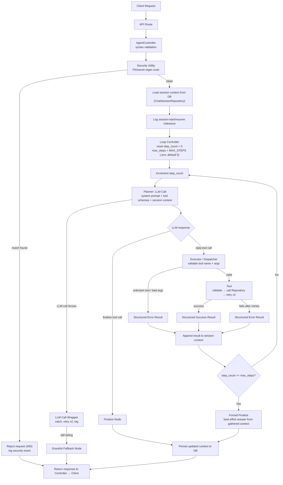

# Agent Architecture Plan — Excel Data Assistant

This document specifies the agent runtime (planner, executor, loop control,
finalize path), logging, the system prompt, folder structure, and the tool
design rules/tool inventory (last section, per request). No pre-built
agent/tool frameworks are used anywhere in this design — everything below is
plain Python, an LLM HTTP client, and `sqlite3`.

---

## 0. Request flow — API route → Controller → Agent

Every incoming request passes through a fixed pipeline before the agent loop
ever runs. The agent never receives raw, unvalidated user input directly from
the transport layer.

```
Client
  → API Route (FastAPI)                         backend/routes/api.py
    → Controller                                backend/app/controllers/
        - AgentController.handle_message()        (chat requests)
        - SessionController.index/show/delete()    (session management)
    → Validation & Security Utility             backend/app/utilities/security.py
        - syntax validation (non-empty, length bounds, encoding)
        - PII / sensitive-data pattern scan (see below)
    → Agent Loop (Loop Controller → Planner → Executor → Tools)
    → Response back up through Controller → API Route → Client
```

All backend paths below are relative to `backend/` (the FastAPI app's own root —
see the top-level [`DESIGN.md`](../DESIGN.md) and [`README.md`](../README.md)
for how `backend/`, `frontend/`, and `docs/` fit together).

**Controller responsibilities (not the agent's job):**
- `AgentController` receives the raw request body, checks basic syntax
  (message not empty, within a max length, valid encoding), then runs it
  through the security utility before it's allowed anywhere near the LLM or
  the loop controller.
- `SessionController` is a separate, plain CRUD-style controller (no LLM
  involved) — see 2.7.

**Security/PII utility (`backend/app/utilities/security.py`):**
- A dedicated regex-based scanning utility, reusable anywhere in the app —
  not agent-specific.
- Detects common sensitive-data shapes via regex: API keys/tokens (e.g.
  `sk-...`, long hex/base64-looking secrets), email addresses, phone numbers,
  credit card numbers, and similarly structured secrets.
- If a match is found, the controller rejects the request before it reaches
  the agent (HTTP 400 with a generic "request contains data that can't be
  processed" message — never echo back the detected secret), and logs a
  distinct security-event log line (pattern type matched, not the matched
  value itself, to avoid persisting the secret in logs).
- This check runs once, at the controller layer, prior to the agent loop —
  the agent and tools never need to re-check for this.


## 1. Architecture — control flow (Mermaid)



Key rules encoded in this diagram:
- **`step_count` resets to 0 on every new incoming user request** — it is not
  cumulative across a conversation, only within the current request's
  planner/tool loop.
- **`max_steps` defaults to 5**, read from `.env` (`MAX_STEPS`), configurable
  without a code change, but not exposed to the LLM as something it can
  change.
- The loop only exits three ways: (a) LLM calls the `finalize` tool, (b)
  `step_count` hits `max_steps` → forced finalize, (c) an unrecoverable
  exception → graceful fallback. There is no other exit path.
- Session context is **loaded from the DB at the start of the request** and
  **persisted back at the end** (finalize, forced finalize, or fallback) —
  the loop never holds a session's memory only in process memory across
  requests.

---

## 2. Agent components & business logic

### 2.1 Planner (`backend/app/agent/planner.py`)
- Responsibility: single LLM call per step. Input = system prompt + tool
  schemas + running context (prior tool calls/results this request). Output =
  either a tool call (name + args) or a call to `finalize`.
- The planner **never touches the database directly** and never contains
  business logic — it only produces a decision for the executor to carry out.
- Wrapped by the LLM Call Wrapper (2.5) for retries/logging — the planner
  itself doesn't implement retry logic.

### 2.2 Executor / Dispatcher (`backend/app/agent/executor.py`)
- Responsibility: given the planner's chosen tool name + args, look it up in
  a registry (`{tool_name: callable}`), validate the tool exists, and invoke
  it. This is the **only** place that maps an LLM tool-call decision to
  actual Python code — tools themselves are never called directly from the
  planner or loop controller.
- If the tool name doesn't exist, or args fail schema validation before
  reaching the tool, return a structured error immediately (no attempt to
  call anything) — this is a dispatcher-level failure, separate from a
  tool-level failure.
- Logs every dispatch: tool name, args (with any obviously sensitive fields
  redacted), step number, latency, outcome.

### 2.3 Loop Controller (`backend/app/agent/loop_controller.py`)
- Responsibility: owns `step_count` and `max_steps` for the current request,
  drives the step→plan→dispatch→append cycle, and decides when to stop.
- `max_steps` is read from the environment at startup (`MAX_STEPS` in `.env`,
  default `5`) via `backend/config/settings.py` — never hardcoded in the loop
  controller itself.
- At the **start** of a request: resolve the `session_id` (create a new
  session via `SessionRepository` if none was supplied), load that session's
  stored `context` from the DB, and log the session-start/resume milestone
  (see section 3). `step_count = 0` for this request regardless of how much
  prior context exists — the step budget is per-request, the context is
  per-session.
- After each tool result is appended to the in-memory context: check
  `step_count >= max_steps`. If true and the LLM has not called `finalize`,
  the loop controller forces a finalize (see 2.4) rather than looping again.
- At the **end** of a request (finalize, forced finalize, or fallback): the
  updated context is written back to the session row via
  `ChatSessionRepository.save_context()` before the response is returned —
  the loop never keeps a session's memory only in process memory between
  requests.
- Wraps the entire per-request loop in a top-level `try/except`. Any
  exception not already handled by a lower layer (planner, executor, tool)
  is caught here, logged at `ERROR` with full traceback, and converted into
  the graceful fallback response — the user never sees a stack trace or raw
  exception text.

### 2.4 Finalize node (`backend/app/agent/finalize.py`)
- `finalize` is itself exposed to the LLM as a tool (same function-calling
  mechanism as the data tools), with a single argument: the natural-language
  answer to return to the user. Calling it is how the LLM signals "I'm done."
- **Forced finalize** (max steps reached, no `finalize` call yet): the loop
  controller does *not* ask the LLM to try again — it constructs a best-
  effort response from whatever tool results are already in context (or,
  if none are usable, a plain "I wasn't able to complete this within the
  step budget" message), and returns immediately. This guarantees the
  request terminates at exactly `max_steps` LLM calls, protecting latency.
- **Graceful fallback** (unhandled exception anywhere in the loop): a fixed,
  user-safe message (e.g. "Something went wrong processing that request —
  please try again or rephrase it.") — never exposes internals.

### 2.5 LLM Call Wrapper (`backend/app/agent/llm_client.py`, provider clients in `backend/app/agent/llm_factory.py`)
- Single choke point for every LLM API call (used by the planner). Wraps the
  actual HTTP call in `try/except`, retries transient failures up to 2 times
  (network errors, rate limits, timeouts) with backoff, and logs on every
  attempt regardless of outcome — see section 3.
- If all retries fail, raises a typed exception that the loop controller
  catches and turns into the graceful fallback.

### 2.7 Session Controller (`backend/app/controllers/session_controller.py`)
- A plain CRUD controller, no LLM/agent logic involved — sits at the API
  layer, backed directly by `ChatSessionRepository`.
- `index()` — list sessions (id, session_name, created_at, updated_at; not
  the full context blob, to keep the listing response small).
- `show(session_id)` — return one session including its full stored
  `context`, for inspection/debugging or resuming a conversation client-side.
- `delete(session_id)` — remove a session row. Should be a hard delete (this
  is a hiring-task scope, not a system needing soft-delete/audit trail).
- Exposed via routes such as `GET /sessions`, `GET /sessions/{id}`,
  `DELETE /sessions/{id}` in `backend/routes/api.py`.

### 2.8 Data flow summary
`Client → API Route → AgentController (syntax check) → Security Utility (PII
scan) → Loop Controller (load session context, reset step) → Planner (LLM) →
Executor (dispatch) → Tool (validate → call Repository → retry) → structured
result → back into session context → Loop Controller decides
continue/finalize → persist context → Response`

Note the repository dependency: **tools never talk to SQLite directly.**
Every data tool calls the matching repository method
(`RealEstateRepository`, `CampaignRepository`) for the actual SQL — the tool
layer owns validation, retry, and the structured result envelope; the
repository layer owns the SQL and transaction handling. This keeps the same
separation already used for the dataset repositories, and means swapping the
storage engine later only touches `backend/app/repositories/`, not
`backend/app/tools/`.

---

## 3. Logging requirements (instructions for the coding agent)

Every LLM call and every tool call must produce one structured log line
(JSON, via Python's `logging` + a JSON formatter — no external logging
framework needed). Use a single `request_id` (generated once per incoming
user request) threaded through every log line for that request, plus the
current `step_number`, so a full trace of one request can be reconstructed
end-to-end from the logs.

**Session-start milestone (log this distinctly, not just as a regular log
line):** the moment the Loop Controller resolves/loads a session — whether a
brand-new session is created or an existing one is resumed — emit one clearly
tagged log entry (e.g. `event: "session_start"` or `"session_resume"`) with
`session_id`, `request_id`, and whether it's new or resumed. This is the
anchor point for tracing a full request end-to-end in the logs: every
subsequent LLM/tool log line for that request should be findable by
searching for the `request_id` first seen at this milestone.

**Per LLM call, log:**
- `request_id`, `step_number`
- `model` name
- `prompt_tokens`, `completion_tokens`, `total_tokens` (from the API response)
- `latency_ms` (wall-clock time of the call)
- `cost_usd` — compute from a small static per-model pricing table (`$/1K
  tokens` in, out); if using a free tier where cost is genuinely $0, log
  `0.0` explicitly rather than omitting the field, so the field is always
  present and comparable across runs
- `attempt_number` (1, 2, 3 if retried)
- `success` (bool), `error` (string or null)
- timestamp

**Per tool call, log:**
- `request_id`, `step_number`, `tool_name`
- `args` (redact if any field is sensitive — not expected here, but keep the
  hook)
- `attempt_number` (tool's own internal retry count, 1 or 2)
- `latency_ms`
- `success` (bool), `error` (string or null)

**Implementation instruction:** wrap the raw LLM SDK/HTTP call and every tool
function body in `try/except`, capture start/end time around the call, and
emit the log line in a `finally` block so it's written whether the call
succeeded or raised. Never let a logging failure itself crash the request —
logging calls are also wrapped defensively.

---

## 4. System prompt

The schema is embedded directly in the system prompt (both tables, exact
columns) specifically to remove the need for a "list/describe tables" tool
round-trip — this is a deliberate latency optimization, since every avoided
tool call saves a full planner LLM round-trip.

```
You are a data assistant for a real estate and marketing analytics system.
You can query, insert, update, and delete records in two tables. You have
NO other data sources — do not assume any table, column, or data beyond
what is listed below exists.

## Table: real_estate_listings
Primary key: listing_id (format: "LST-XXXX")
Columns:
- listing_id (text, e.g. "LST-5001")
- property_type (text, e.g. "House", "Condo")
- city (text)
- state (text, full state name, e.g. "Illinois")
- bedrooms (integer)
- bathrooms (real, e.g. 1.5, 3.5)
- square_footage (integer)
- year_built (integer)
- list_price (real, USD)
- sale_price (real, USD, nullable — null means not yet sold)
- listing_status (text: "Active", "Pending", or "Sold")

## Table: marketing_campaigns
Primary key: campaign_id (format: "CMP-XXXX")
Columns:
- campaign_id (text, e.g. "CMP-8001")
- campaign_name (text)
- channel (text, e.g. "Facebook", "LinkedIn", "Instagram")
- start_date (text, ISO date "YYYY-MM-DD")
- end_date (text, ISO date "YYYY-MM-DD")
- budget_allocated (real, USD)
- amount_spent (real, USD)
- impressions (integer)
- clicks (integer)
- conversions (integer)
- revenue_generated (real, USD)

## Tools available to you
You have read/insert/update/delete tools for each table (schemas provided
separately via function-calling) and one control tool: `finalize`.

## Rules you must follow
1. You have a maximum of {max_steps} tool-call steps for this request. Work
   efficiently — do not call a tool to look up something you can already
   answer from this prompt (e.g. you already know the table schemas — do
   not ask for them).
2. When you have enough information to answer the user, call `finalize`
   with your final natural-language answer. Do not call finalize before you
   actually have the answer.
3. Update and delete operations must target an exact listing_id or
   campaign_id. If the user's request is ambiguous about which specific
   record(s) to modify, ask for clarification via `finalize` rather than
   guessing or acting on a broad filter.
4. If a tool call fails, read the error message in the result — it tells
   you what went wrong. Do not blindly repeat the exact same call; adjust
   your arguments or explain the issue to the user via finalize if it can't
   be resolved.
5. Never fabricate data. If a tool returns no results, say so plainly.
```

`{max_steps}` is interpolated at runtime from the loop controller's
configured value, so the LLM's own understanding of its budget always
matches the actual enforced limit.

---

## 5. Folder structure

```
project_root/
├── backend/                      # Everything below is relative to backend/ — see DESIGN.md
│   ├── routes/
│   │   └── api.py               # FastAPI routes: /agent/chat, /sessions, /sessions/{id}
│   ├── app/
│   │   ├── controllers/
│   │   │   ├── agent_controller.py   # syntax validation + security scan -> loop controller
│   │   │   └── session_controller.py # index/show/delete, backed by ChatSessionRepository
│   │   ├── agent/
│   │   │   ├── planner.py       # single LLM call per step, decision only
│   │   │   ├── executor.py      # dispatch: tool name/args -> tool call
│   │   │   ├── loop_controller.py # step_count, max_steps (.env), session load/save, finalize/fallback
│   │   │   ├── finalize.py      # finalize tool + forced-finalize + fallback text
│   │   │   ├── llm_client.py    # LLM HTTP wrapper: retry, logging, cost calc (provider-agnostic)
│   │   │   ├── llm_factory.py   # LLMProviderClient registry (GroqClient today)
│   │   │   └── prompts.py       # system prompt template (section 4)
│   │   ├── tools/
│   │   │   ├── registry.py           # {tool_name: callable} + JSON schemas for function-calling
│   │   │   ├── real_estate_tools.py  # query/insert/update/delete for real_estate_listings (calls RealEstateRepository)
│   │   │   ├── campaigns_tools.py    # query/insert/update/delete for marketing_campaigns (calls CampaignRepository)
│   │   │   └── finalize_tool.py      # finalize tool definition (schema only; logic lives in agent/finalize.py)
│   │   ├── repositories/
│   │   │   ├── real_estate_repository.py
│   │   │   ├── campaign_repository.py
│   │   │   └── chat_session_repository.py
│   │   ├── utilities/
│   │   │   ├── security.py       # regex-based PII/secret pattern scanner (section 0)
│   │   │   ├── logging_utils.py  # structured JSON logging helpers (section 3)
│   │   │   └── tool_execution.py # shared retry/timeout wrapper used by the tool layer
│   │   └── models/
│   │       └── schemas.py       # Pydantic models: tool inputs/outputs, structured results
│   ├── db/
│   │   ├── database.py          # connection factory + migration runner
│   │   ├── migrations/
│   │   │   ├── 0001_create_real_estate_listings.sql
│   │   │   ├── 0002_create_marketing_campaigns.sql
│   │   │   └── 0003_create_chat_sessions.sql
│   │   └── seed_database.py
│   ├── data/                    # source Excel files consumed by the seeder
│   │   ├── Real Estate Listings.xlsx
│   │   └── Marketing Campaigns.xlsx
│   ├── logs/                    # JSON log output (gitignored)
│   ├── config/
│   │   └── settings.py          # reads .env: MAX_STEPS (default 5), model config, pricing table
│   ├── tests/                   # pytest suite, mirrors app/ package layout
│   ├── main.py                  # entry point / FastAPI app
│   ├── .env                     # MAX_STEPS, LLM API keys/config (gitignored)
│   ├── .env.example             # committed template, no real secrets
│   ├── requirements.txt
│   └── README.md                # backend-specific setup/run/test instructions
├── frontend/                     # React (Vite) chat UI — see frontend/README.md
├── docs/                         # PRD, technical spec, this file, per-feature issue tickets
├── README.md                     # project overview, quick start
├── DESIGN.md                     # high-level system design (this repo's map)
└── DECISIONS.md                  # architecture decisions & trade-offs log
```

---

## 6. Tool inventory

All tools are exposed to the LLM via function-calling schemas defined in
`backend/app/tools/registry.py`. Every data tool below calls its matching
repository method for the actual SQL — no tool file contains raw SQL itself
(see 7.1).

| # | Tool name | Verb | Table | Repository method called | Key args |
|---|---|---|---|---|---|
| 1 | `query_real_estate` | read | `real_estate_listings` | `RealEstateRepository.query()` | filters (city, state, status, price range, beds/baths range), `limit` (capped server-side) |
| 2 | `insert_real_estate` | create | `real_estate_listings` | `RealEstateRepository.insert()` | all listing fields |
| 3 | `update_real_estate` | modify | `real_estate_listings` | `RealEstateRepository.update()` | `listing_id` (required, exact), fields to change |
| 4 | `delete_real_estate` | delete | `real_estate_listings` | `RealEstateRepository.delete()` | `listing_id` (required, exact) |
| 5 | `query_campaigns` | read | `marketing_campaigns` | `CampaignRepository.query()` | filters (channel, date range, campaign_name), `limit` (capped server-side) |
| 6 | `insert_campaign` | create | `marketing_campaigns` | `CampaignRepository.insert()` | all campaign fields |
| 7 | `update_campaign` | modify | `marketing_campaigns` | `CampaignRepository.update()` | `campaign_id` (required, exact), fields to change |
| 8 | `delete_campaign` | delete | `marketing_campaigns` | `CampaignRepository.delete()` | `campaign_id` (required, exact) |
| 9 | `finalize` | control | — | none (no DB access) | `answer` (the final natural-language response) |

`finalize` is architecturally different from the other 8: it never touches
the repository layer or the database, and calling it is what ends the loop
(section 2.4) rather than producing a result that gets appended and looped
on again.

---

## 7. Tool design rules

Your listed rules, restated with the operational meaning each one has here:

- **One responsibility per tool** — one tool = one verb on one table (e.g.
  `update_real_estate` only updates `real_estate_listings`; it does not also
  handle campaigns or perform reads).
- **Deterministic** — given identical input *and identical database state*,
  output is identical. (The caveat matters: a `query_real_estate` call is
  deterministic relative to DB state, but DB state itself changes over time
  as writes happen — that's expected and not a violation of determinism.)
- **Tools never think** — no LLM calls inside a tool, no heuristic
  interpretation of ambiguous input, no fuzzy matching of user intent. If an
  argument is ambiguous or missing, the tool rejects it with a validation
  error; it does not guess.
- **Tools return structured data** — every tool returns the same envelope
  shape regardless of success/failure (see 7.2), never a raw string or bare
  exception.
- **Tools validate everything** — both schema-level (types, required fields,
  via Pydantic) and business-rule level (e.g. `bedrooms >= 0`,
  `listing_status` is one of the three allowed values, referenced
  `listing_id` actually exists before an update/delete is attempted).
- **Tools are domain-agnostic** — a tool has no awareness it's being called
  by an LLM agent. It doesn't format natural language, doesn't reason about
  "what the user probably meant," and is callable and testable on its own
  (e.g. from a unit test or a plain script) with zero agent code involved.
- **Tools hide implementation** — callers only see tool name, JSON schema,
  and result envelope. SQL and pandas details live entirely inside the tool
  /repository layer; swapping SQLite for another store later would not
  change any tool's external contract.

### 7.1 Per-tool operational contract

Every tool (all 8 data tools) must:
1. Validate input shape + business rules first, before calling the
   repository layer at all.
2. **Delegate the actual DB operation to the matching repository method** —
   `RealEstateRepository` / `CampaignRepository`. The tool file itself contains
   no raw SQL; the repository owns the SQL and the explicit transaction
   (`BEGIN`/`COMMIT`/`ROLLBACK`) — atomic and isolated, so a failure midway
   never leaves a partial write.
3. Wrap the repository call in `try/except`, and on failure, retry up to
   **2 times** internally (the tool owns its own retry loop — the executor/
   planner does not retry a tool call itself).
4. On final failure (after 2 attempts), return a structured error result
   with a plain-language message describing that *this tool* failed (e.g.
   `"update_real_estate failed after 2 attempts: listing_id 'LST-9999' not
   found"`) — worded so the LLM can tell specifically which tool failed and
   why, which is what lets the loop/LLM detect a repeated-failure pattern
   instead of blindly retrying the same call.
5. Log every attempt (section 3).

### 7.2 Standard result envelope (all tools, including `finalize`)

```json
{
  "success": true,
  "data": { ... } ,
  "error": null,
  "tool": "update_real_estate",
  "attempts": 1
}
```
or on failure:
```json
{
  "success": false,
  "data": null,
  "error": "update_real_estate failed after 2 attempts: listing_id 'LST-9999' not found",
  "tool": "update_real_estate",
  "attempts": 2
}
```

### 7.3 Gaps in the rule set worth adding

A few things your list doesn't explicitly cover, that matter for this task:

1. **Machine-readable tool schemas.** The rules describe tool *behavior* but
   not its *interface*. Each tool needs a JSON-schema-style definition
   (name, description, parameter types/required fields) exposed to the LLM
   via function-calling — without this, the planner has no reliable way to
   know how to call a tool correctly. Put these in `app/tools/registry.py`.
2. **Row limits on read tools.** `query_real_estate` / `query_campaigns` must
   cap returned rows (e.g. default/max `limit` of ~20–50) regardless of what
   the LLM asks for. Given latency is critical, an unbounded query result
   dumped back into the LLM context is one of the biggest avoidable sources
   of slow, expensive next-step calls.
3. **Write-scope safety.** `update_real_estate`/`delete_real_estate` (and the
   campaign equivalents) should only ever operate on an exact primary key,
   never a filter (e.g. "delete all pending listings in Texas"). This is
   already implied by "one responsibility per tool," but it's worth stating
   explicitly as a guardrail, since it's the one mistake that causes real
   data loss from an ambiguous natural-language request.
4. **Idempotency on internal retries.** If a write tool retries itself
   twice, you need a way to tell "attempt 1 actually succeeded but the
   confirmation was lost" apart from "attempt 1 genuinely failed" — otherwise
   a retry after a false failure signal double-applies the write (double
   insert, double decrement). Practically here: check-before-write (e.g. for
   insert, check the primary key doesn't already exist immediately before
   inserting) is enough given local SQLite's low failure surface — no need
   for a full idempotency-key system at this scale, but it should be a
   deliberate, statable decision in `DECISIONS.md`, not an oversight.
5. **Per-call timeout.** A hung DB call (lock contention, etc.) inside a tool
   should not be able to hang the whole loop indefinitely — wrap tool
   execution with a timeout that counts as a failure (triggering the normal
   retry/error path) rather than blocking.
6. **End-to-end correlation.** Tie every LLM-call log and every tool-call log
   for one user request together under the same `request_id` (section 3) —
   this is what makes it possible to reconstruct exactly what happened, step
   by step, when you're defending a specific run in the live call.